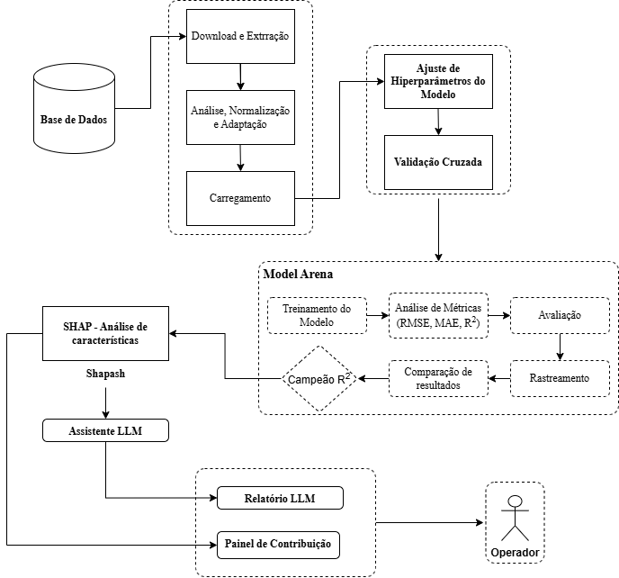

# Modelos Explicáveis para Processos Industriais
### Avanços e Aplicações de IA na Indústria 5.0


Projeto de Iniciação Científica (PIBIC) da Universidade de Pernambuco (UPE / POLI-PE), focado na construção de pipelines de manutenção preditiva com explicabilidade auditável e relatórios orientados ao operador humano — alinhado ao paradigma de colaboração humano-máquina da Indústria 5.0.

---

## Sumário

- [Modelos Explicáveis para Processos Industriais](#modelos-explicáveis-para-processos-industriais)
    - [Avanços e Aplicações de IA na Indústria 5.0](#avanços-e-aplicações-de-ia-na-indústria-50)
  - [Sumário](#sumário)
  - [Visão Geral](#visão-geral)
  - [Datasets](#datasets)
    - [NASA C-MAPSS FD001](#nasa-c-mapss-fd001)
  - [Arquitetura do Projeto](#arquitetura-do-projeto)
  - [Pré-requisitos](#pré-requisitos)
  - [Instalação](#instalação)
  - [Configuração](#configuração)
  - [Execução](#execução)
    - [Pipeline Modular (recomendado)](#pipeline-modular-recomendado)
    - [Notebooks](#notebooks)
      - [NASA C-MAPSS (caso principal)](#nasa-c-mapss-caso-principal)
      - [AI4I 2020](#ai4i-2020)
      - [Hydraulic System](#hydraulic-system)
  - [Fluxo do Pipeline NASA](#fluxo-do-pipeline-nasa)
  - [Resultados](#resultados)
    - [NASA C-MAPSS FD001 — Teste Oficial NASA](#nasa-c-mapss-fd001--teste-oficial-nasa)
    - [MAE por faixa de RUL (CatBoost)](#mae-por-faixa-de-rul-catboost)
    - [Protocolo de avaliação](#protocolo-de-avaliação)
  - [Explicabilidade (XAI)](#explicabilidade-xai)
  - [Assistente LLM](#assistente-llm)
  - [Rastreamento de Experimentos](#rastreamento-de-experimentos)
  - [Reprodutibilidade](#reprodutibilidade)
  - [Referências](#referências)
  - [Licença](#licença)

---

## Visão Geral

O projeto investiga como tornar decisões de modelos preditivos industriais **compreensíveis, auditáveis e acionáveis** para operadores humanos. Para isso, combina três camadas:

1. **Predição** — torneio de algoritmos de machine learning com tuning bayesiano para selecionar o modelo de melhor desempenho.
2. **Explicabilidade** — geração de relatórios XAI globais e locais via Shapash, identificando os sensores físicos responsáveis pela degradação de cada equipamento.
3. **Tradução** — um assistente LLM (Gemini) que transforma a saída matemática do XAI em laudos técnicos em linguagem natural, direcionados ao mecânico de pista.

O caso principal de estudo é o problema de **Vida Útil Restante (RUL)** de motores turbofan com o dataset NASA C-MAPSS FD001.

---

## Datasets

| Dataset | Domínio | Tarefa | Cobertura |
|---|---|---|---|
| **NASA C-MAPSS FD001** | Motores turbofan | Regressão de RUL | Pipeline modular `src/` + notebooks 08–11 |
| **AI4I 2020** | Processo industrial | Classificação de falha | Notebooks 01–04 |
| **Hydraulic System (UCI)** | Sistema hidráulico | Classificação de condição | Notebooks 05–07 |

### NASA C-MAPSS FD001

Dataset de simulação de degradação de motores turbofan publicado pela NASA. Contém 100 motores com leituras de 21 sensores ao longo de ciclos operacionais até a falha. A tarefa é prever quantos ciclos restam antes da falha crítica de cada motor.

O projeto segue o protocolo padrão da literatura (Saxena & Goebel, 2008):
- **Treino:** arquivo `train_FD001.txt` completo.
- **Teste:** último ciclo de cada motor em `test_FD001.txt`, comparado ao `RUL_FD001.txt`.
- **RUL clipado em 125 ciclos** (piecewise-linear, conforme Heimes 2008 e Babu et al. 2016).

---

## Arquitetura do Projeto

```
PIBIC-XAI-Industry5.0/
│
├── src/                          # Pipeline modular (caso NASA)
│   ├── config.py                 # Constantes, caminhos, arena de modelos, features_dict
│   ├── data_pipeline.py          # ETL: download, RUL, pré-processamento, teste oficial
│   ├── train.py                  # Optuna, GroupKFold CV, treino final, build_model
│   ├── evaluation.py             # Métricas, NASA score, MAE por faixa, gráficos
│   ├── explainability.py         # Shapash: importância global + caso local crítico
│   ├── llm_assistant.py          # Gemini: laudo técnico para operador
│   └── main.py                   # Orquestrador das 4 fases
│
├── notebooks/
│   ├── 01–04                     # Exploração e XAI — AI4I 2020
│   ├── 05–07                     # ETL, XAI e dashboard — Hydraulic System
│   └── 08–11                     # Pipeline exploratório — NASA C-MAPSS
│
├── docs/
│   ├── RESULTADOS_NASA.md        # Análise narrativa dos resultados
│   ├── nasa/
│   │   ├── resultados.json       # Métricas estruturadas do experimento atual
│   │   └── Verificacao_RUL_Real_vs_Predito.png
│   ├── ai4i/                     # Relatórios XAI do AI4I
│   ├── hydraulic/                # Relatórios XAI do sistema hidráulico
│   ├── plots/                    # Gráficos gerados pelo pipeline (regeneráveis)
│   ├── reports/                  # Relatórios Shapash HTML + laudos LLM (regeneráveis)
│   └── optuna_studies/           # Studies do Optuna salvos em .pkl
│
├── data/
│   ├── raw/nasa/                 # Dados brutos (baixados automaticamente)
│   └── processed/nasa/           # CSVs processados (gerados pelo ETL)
│
├── mlruns/                       # Experimentos MLflow (gerado localmente)
├── .env.example                  # Template de variáveis de ambiente
├── requirements.txt              # Dependências do projeto
└── README.md
```

---

## Pré-requisitos

- **Python 3.10 ou superior**
- Conexão com a internet (para download automático do dataset NASA e chamadas à API Gemini)
- Chave de API do Google Gemini (opcional — o pipeline funciona em modo simulado sem ela)

---

## Instalação

**1. Clone o repositório**

```bash
git clone https://github.com/seu-usuario/PIBIC-XAI-Industry5.0.git
cd PIBIC-XAI-Industry5.0
```

**2. Crie e ative um ambiente virtual**

```bash
# Criar
python -m venv .venv

# Ativar — Linux/macOS
source .venv/bin/activate

# Ativar — Windows
.venv\Scripts\activate
```

**3. Instale as dependências**

```bash
pip install -r requirements.txt
```

---

## Configuração

**1. Crie o arquivo de variáveis de ambiente**

```bash
cp .env.example .env
```

**2. Edite o `.env` e adicione sua chave do Gemini**

```env
GEMINI_API_KEY=sua_chave_aqui
```

> **Sem chave do Gemini?** O pipeline continua funcionando normalmente. Na Fase 4, o assistente LLM entra em modo simulado e gera um laudo de exemplo sem consumir a API.

> **Segurança:** o arquivo `.env` está no `.gitignore` e nunca deve ser commitado. Nunca insira a chave diretamente no código-fonte.

---

## Execução

### Pipeline Modular (recomendado)

Execute o pipeline completo com um único comando a partir da raiz do projeto:

```bash
python -m src.main
```

O pipeline executa as 4 fases em sequência e exibe o progresso no terminal:

```
Iniciando o Pipeline da Indústria 5.0...

[Fase 1] Engenharia e Processamento de Dados
  → Download do dataset NASA C-MAPSS (se necessário)
  → Cálculo do RUL com clip em 125 ciclos
  → Remoção de sensores de baixa variância e normalização
  → Geração do teste oficial NASA

[Fase 2] Tuning Bayesiano com Optuna
  → Random_Forest: 60 trials (retoma study salvo se existir)
  → XGBoost: 60 trials
  → CatBoost: 60 trials

[Fase 3] Torneio Final de Modelos Preditivos (RUL)
  → Avaliando: Linear_Regression
  → Avaliando: KNN
  → Avaliando: Random_Forest
  → Avaliando: XGBoost
  → Avaliando: CatBoost
  ==================================================
  Modelo Campeão: CatBoost (R²: 0.8246)
  ==================================================

[Fase 4] XAI e Tradução para o Operador (CatBoost)
  → Explicações Shapash geradas
  → Laudo do operador salvo em docs/reports/
```

> **Tempo estimado:** a Fase 2 (tuning com 60 trials por modelo) é a mais longa. Espere entre 1h e 3h dependendo do hardware. As fases seguintes são rápidas. Na segunda execução, o Optuna retoma os studies salvos e não reprocessa trials já concluídos.

> **Execução rápida para testes:** edite `N_OPTUNA_TRIALS = 2` em `src/config.py` para validar o fluxo completo em poucos minutos antes de rodar o tuning completo.

---

### Notebooks

Os notebooks servem como ambiente exploratório e demos interativos. Execute-os na sequência indicada.

#### NASA C-MAPSS (caso principal)

| Notebook | Descrição |
|---|---|
| `08_etl_nasa_cmaps.ipynb` | ETL exploratório: carregamento, visualização dos sensores e cálculo do RUL |
| `09_auditoria_tecnica_nasa.ipynb` | Demo do pipeline modular: chama `src/` e exibe os relatórios Shapash interativos |
| `10_registro_mlflow_nasa.ipynb` | ⚠️ Deprecado — o registro no MLflow agora ocorre automaticamente em `src/main.py` |
| `11_assistente_llm_operador.ipynb` | Geração interativa do laudo LLM com Gemini |

```bash
jupyter notebook notebooks/08_etl_nasa_cmaps.ipynb
```

#### AI4I 2020

| Notebook | Descrição |
|---|---|
| `01_exploracao_dados_ai4i.ipynb` | Análise exploratória do dataset AI4I |
| `02_dashboard_interativo_ai4i.ipynb` | Dashboard interativo com Shapash |
| `03_auditoria_tecnica_ai4i.ipynb` | XAI: importância global e caso local de falha |
| `04_registro_experimentos_mlflow.ipynb` | Registro de experimentos no MLflow |

#### Hydraulic System

| Notebook | Descrição |
|---|---|
| `05_etl_processamento_hidraulico.ipynb` | ETL e pré-processamento dos dados hidráulicos |
| `06_auditoria_tecnica_hidraulico.ipynb` | XAI: análise de condição do sistema hidráulico |
| `07_dashboard_interativo_hidraulico.ipynb` | Dashboard interativo com Shapash |

---

## Fluxo do Pipeline NASA

O diagrama abaixo detalha as decisões e transformações de cada fase:



---

## Resultados

Os resultados abaixo correspondem ao experimento documentado em `docs/nasa/resultados.json` (run_id MLflow: `2f85d8faca744cf2af35cfe5eec64c00`).

### NASA C-MAPSS FD001 — Teste Oficial NASA

| Modelo | MAE ↓ | RMSE ↓ | R² ↑ | NASA Score ↓ |
|---|---:|---:|---:|---:|
| **CatBoost** *(campeão)* | **11,79** | **16,78** | **0,825** | **772,8** |

### MAE por faixa de RUL (CatBoost)

| Faixa | MAE | Interpretação |
|---|---:|---|
| RUL 0–25 ciclos *(crítico)* | 9,01 | Erros próximos da falha — mais relevantes para manutenção |
| RUL 25–75 ciclos *(médio)* | 13,27 | Faixa de alerta de manutenção preventiva |
| RUL 75+ ciclos *(distante)* | 12,09 | Motores saudáveis, menor urgência |

### Protocolo de avaliação

- **Split:** treino em `train_FD001.txt` e teste no último ciclo de cada motor em `test_FD001.txt` contra `RUL_FD001.txt` (protocolo Saxena & Goebel, 2008)
- **RUL cap:** 125 ciclos
- **Sensores removidos:** sensor_1, sensor_5, sensor_10, sensor_16, sensor_18, sensor_19
- **Normalização:** MinMaxScaler ajustado no treino, aplicado ao teste com `transform()`
- **NASA Score:** função assimétrica — penaliza subestimação do RUL mais severamente que superestimação

Os gráficos de validação estão em `docs/plots/` e os relatórios narrativos em `docs/RESULTADOS_NASA.md`.

---

## Explicabilidade (XAI)

O módulo de explicabilidade usa a biblioteca **Shapash** com mapeamento de nomes físicos dos sensores, permitindo que os relatórios apresentem "Physical fan speed" em vez de "sensor_8".

**Relatórios gerados:**

| Arquivo | Conteúdo |
|---|---|
| `docs/reports/shapash_global.html` | Importância global de todas as features no conjunto de teste |
| `docs/reports/shapash_local_critico.html` | Contribuição de cada sensor para o motor em estado mais crítico |

**Identificação do motor crítico:**

O motor crítico é identificado pelo maior **risco combinado** — não pelo menor RUL predito isoladamente:

```
risco_combinado = RUL_predito − desvio_padrão_entre_árvores
motor_crítico   = argmin(risco_combinado)
```

Essa abordagem penaliza motores com alta incerteza de predição, o que é mais conservador e adequado para decisões de manutenção. Para modelos sem `estimators_` (KNN, Linear Regression), o motor crítico é identificado pelo menor RUL predito diretamente.

O resultado identifica o motor pelo **engine_id real e ciclo operacional**, não por índice de linha — informação que o operador consegue rastrear no sistema de manutenção.

---

## Assistente LLM

O módulo `llm_assistant.py` recebe o diagnóstico do XAI e gera um laudo curto, em linguagem de mecânico de pista, via **Gemini 2.5 Flash**.

**Exemplo de saída:**

```
==================================================
Laudo do Assistente de IA:
==================================================
Motor 45 requer inspeção imediata. A vida útil estimada é de
apenas 12 ciclos, com degradação concentrada na temperatura
de saída do compressor de alta pressão (HPC). Verifique o
sistema de resfriamento e as sondas de temperatura nessa
seção antes do próximo voo.
==================================================
```

O laudo é salvo automaticamente em `docs/reports/operator_report_{modelo}_engine_{id}.md` e registrado no MLflow como artefato do run do campeão.

**Funcionamento sem API:**

Se a variável `GEMINI_API_KEY` não estiver configurada no `.env`, o sistema entra em modo simulado e gera um laudo padrão sem interromper o pipeline.

---

## Rastreamento de Experimentos

O projeto usa **MLflow** para registrar todos os experimentos. Cada modelo do torneio recebe um run próprio com:

- Hiperparâmetros utilizados
- Métricas: MAE, RMSE, R², NASA Score, MAE por faixa de RUL
- Artefatos: gráficos de validação, relatórios Shapash HTML, laudo do operador
- Modelo serializado

**Para visualizar os experimentos no navegador:**

```bash
mlflow ui --backend-store-uri mlruns/
```

Acesse `http://127.0.0.1:5000` para explorar os runs, comparar modelos e visualizar os artefatos.

> **Aviso:** versões recentes do MLflow recomendam migração para backend SQLite. O projeto ainda usa o filesystem (`mlruns/`), que permanece funcional mas exibirá um `FutureWarning`. Para silenciar o aviso, substitua `MLFLOW_TRACKING_URI` em `src/config.py` por `sqlite:///mlflow.db`.

---

## Reprodutibilidade

| Mecanismo | Descrição |
|---|---|
| `SEED = 42` | Seed global aplicado em `main.py` via `random.seed()` e `numpy.random.seed()` |
| `TPESampler(seed=42)` | Reprodutibilidade do Optuna entre execuções |
| Studies em disco | `docs/optuna_studies/study_*.pkl` — permite retomar o tuning sem reprocessar |
| `requirements.txt` em UTF-8 | Dependências sem BOM, instaláveis diretamente com `pip install` |
| `nbstripout` | Outputs dos notebooks removidos antes do commit via Git filter |
| `.gitignore` | Exclui: dados brutos e processados, `mlruns/`, `.env`, HTMLs do Shapash, laudos LLM |
| `resultados.json` | Snapshot estruturado do experimento com `mlflow_run_id` para rastreamento |

---

## Referências

- **NASA C-MAPSS Dataset:** Saxena, A. & Goebel, K. (2008). *Turbofan Engine Degradation Simulation Data Set*. NASA Ames Prognostics Data Repository.
- **Protocolo de avaliação RUL:** Saxena, A. et al. (2008). *Damage Propagation Modeling for Aircraft Engine Run-to-Failure Simulation*. ICIECS.
- **RUL piecewise-linear:** Heimes, F. O. (2008). *Recurrent neural networks for remaining useful life estimation*. ICIECS.
- **Benchmark deep learning:** Babu, G. S., Zhao, P., Li, X. L. (2016). *Deep convolutional neural network based regression approach for estimation of remaining useful life*. DASFAA.
- **Shapash:** [shapash.readthedocs.io](https://shapash.readthedocs.io)
- **MLflow:** [mlflow.org](https://mlflow.org)
- **Optuna:** [optuna.readthedocs.io](https://optuna.readthedocs.io)
- **Google GenAI SDK:** [ai.google.dev](https://ai.google.dev)

---

## Licença

Distribuído sob a [Licença MIT](LICENSE).

---

*Projeto de Iniciação Científica — Universidade de Pernambuco (UPE / POLI-PE)*
*Engenharia de Computação — Área: Inteligência Artificial Explicável (XAI) para Indústria 5.0*